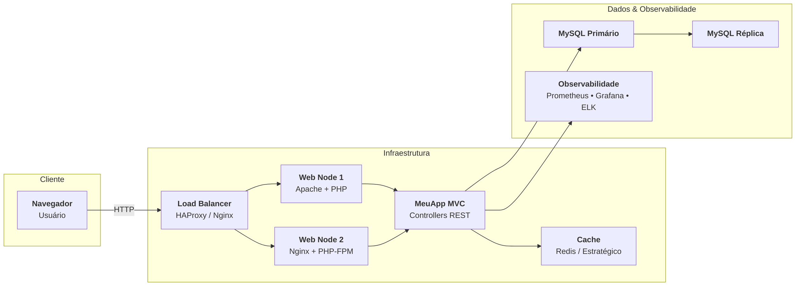
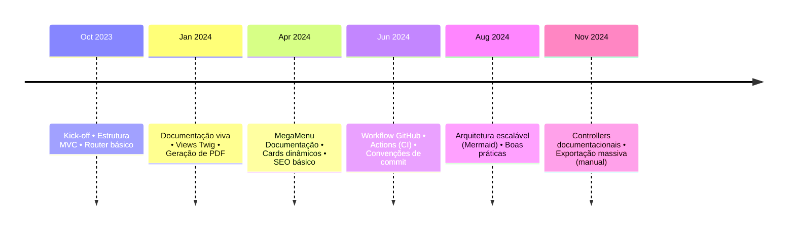
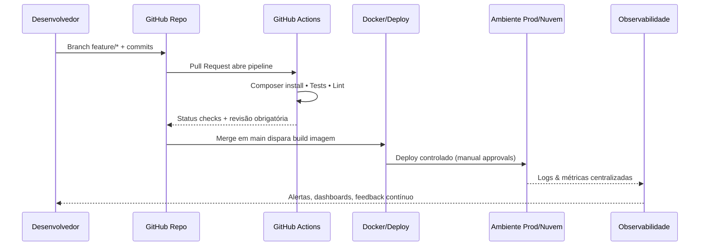

<div align="center">
  
  <h1>MeuApp MVC - Projeto PHP</h1>
  <p>Base educacional e profissional para projetos PHP 8+ com Twig, Bootstrap e documentação viva</p>

  <p>
    <a href="https://www.php.net/"></a>
    <a href="https://twig.symfony.com/"></a>
    <a href="https://getbootstrap.com/"></a>
    <a href="https://github.com/"></a>
  </p>
</div>

---

## 📚 Sumário Rápido

- [📚 Sumário Rápido](#-sumário-rápido)
- [🔭 Visão Geral](#-visão-geral)
- [🧭 Arquitetura em Perspectiva](#-arquitetura-em-perspectiva)
- [🗓 Linha do Tempo do Projeto](#-linha-do-tempo-do-projeto)
- [🚀 Guia de Início Rápido](#-guia-de-início-rápido)
- [🗺 Mapa da Documentação Viva](#-mapa-da-documentação-viva)
- [🔁 Workflow Git \& GitHub](#-workflow-git--github)
- [⚙️ Automação CI/CD](#️-automação-cicd)
- [🗂 Estrutura de pastas (resumida)](#-estrutura-de-pastas-resumida)
- [✅ Boas práticas e checklist](#-boas-práticas-e-checklist)
- [🤝 Contribuindo](#-contribuindo)
- [📄 Licença \& crédito](#-licença--crédito)

---

## 🔭 Visão Geral

O **MeuApp MVC** é um projeto em PHP 8+ construído como laboratório para quem deseja:

- praticar arquitetura **Model-View-Controller** moderna;
- versionar conhecimento com **documentação viva** (HTML + PDF);
- incorporar padrões de **DevOps, escalabilidade e testes**;
- utilizar um stack atual (Twig, Bootstrap 5, Composer, DOMPDF, GitHub Actions).

A aplicação está dividida em dois grandes blocos: **Frontend** para documentação/experiência pública e **Admin** para módulos de gerenciamento. Toda a documentação HTML possui modo exportação (flag `export`) que gera PDF profissional via DOMPDF.

---

## 🧭 Arquitetura em Perspectiva



<details>
  <summary><strong>Ver diagrama em ASCII (fallback)</strong></summary>

```
Cliente HTTP --> Load Balancer (HAProxy/Nginx)
Load Balancer -> Web Node 1 (Apache + PHP)
Load Balancer -> Web Node 2 (Nginx + PHP-FPM)
Web Nodes -> MeuApp MVC (Controllers REST)
MeuApp MVC -> Cache Redis
MeuApp MVC -> MySQL Primário -> MySQL Réplica
MeuApp MVC -> Observabilidade (Prometheus / Grafana / ELK)
```

</details>

**Destaques técnicos**

- Router próprio com fallback inteligente para `/documentacao/*`.
- Twig com macros (componentização), suportando modo `export` sem JS.
- Logging centralizado e camada de serviços desacoplada.
- Geração de PDFs temáticos com índice lateral e capa automática.
- GitHub Actions rodando testes, lint e builds.

---

## 🗓 Linha do Tempo do Projeto



---

## 🚀 Guia de Início Rápido

```bash
# 1. Clonar o projeto
git clone git@github.com:seu-usuario/meuapp-mvc.git
cd meuapp-mvc

# 2. Instalar dependências
composer install
npm install               # se desejar compilar assets personalizados

# 3. Configurar variáveis
cp .env.example .env
# Ajuste APP_URL, credenciais de DB e provedores de cache

# 4. Gerar cache de diretórios
mkdir -p storage/cache/twig storage/logs public/tmp/pdf
chmod -R 775 storage public/tmp

# 5. Rodar servidor embutido
php -S localhost:8000 -t public

# 6. Executar testes (PHPUnit)
composer test
```

> **Dica:** use o script `composer docs` (customizado em `composer.json`) para abrir o índice da documentação diretamente no navegador.

---

## 🗺 Mapa da Documentação Viva

| Categoria                  | Conteúdo                                                                                   |
|----------------------------|---------------------------------------------------------------------------------------------|
| Guia do Projeto            | [Conceito](resources/views/frontend/documentacao/conceito.twig), [Manual](.../manual.twig) |
| Arquitetura & Estrutura    | [Estrutura](.../estrutura.twig), [Stack](.../stack.twig), [MVC](.../mvc.twig)              |
| Ferramentas                | [Git & GitHub](.../gitgithub.twig), [Twig](.../twig.twig), [Bootstrap](.../bootstrap.twig) |
| Infra & Observabilidade    | [htaccess](.../htaccess.twig), [VirtualHost](.../virtualhost.twig), [Escalabilidade](.../escalabilidade.twig) |
| Dev Workflow               | [Boas Práticas](.../boaspraticas.twig), [Status/Auditoria](.../status.twig)                |
| Exportação PDF             | `/pdf/{slug}` ou `/pdf/configuracao` (bundle completo)                                     |

Cada artigo possui:

- **modo Web** com Mermaid/AOS;
- **modo Export** com fallbacks ASCII;
- botões contextuais para navegar entre os tópicos.

---

## 🔁 Workflow Git & GitHub



- Padrão de commit: `tipo(escopo): mensagem` (`feat(router): ...`).
- Branch naming: `feature/`, `bugfix/`, `hotfix/`, `docs/`.
- Proteções: status checks obrigatórios, squash merge padrão, templates de PR + issue.

---

## ⚙️ Automação CI/CD

- **GitHub Actions** (`.github/workflows/ci.yml`): roda PHPUnit, lint e gera artefatos.
- Deploys podem ser feitos via Actions (environments `staging` e `production`) usando Secrets para chaves SSH e containers.
- Releases com `git tag` automatizam changelog e PDFs via scripts composer (`composer release`).

---

## 🗂 Estrutura de pastas (resumida)

```
app/
  Core/          # Router, Controller base, View compartilhada, logger
  Http/
    Controllers/ # Frontend + Admin + Documentação (fallback slug)
resources/
  views/
    frontend/documentacao/*.twig   # Artigos com export-aware flag
    components/*.twig              # Botões, diagram wrapper, cards
public/
  css/           # style.css, theme-dark.css, pdf-style.css
  tmp/pdf/       # Intermediários gerados pelo DOMPDF
```

Detalhes completos estão no arquivo `estrutura.txt` e na rota `/documentacao/estrutura`.

---

## ✅ Boas práticas e checklist

- [x] PSR-4 e namespaces organizados.
- [x] Twig macros para componentes reutilizáveis.
- [x] Mermaid + fallback ASCII em todos os diagramas.
- [x] PDF massivo (`/pdf/configuracao`) com sumário e bookmarks.
- [x] Workflow GitHub com Actions e branch protections.
- [x] Documentação em português, focada em ensino e produção.
- [x] Logs centralizados (`storage/logs/app.log`) e tratativa de erros 4xx e 5xx.

---

## 🤝 Contribuindo

1. **Fork + branch**: `git checkout -b feature/minha-ideia`.
2. **Commits limpos** seguindo o padrão especificado.
3. **Atualize documentação** se necessário (HTML + fallback).
4. **Abra PR** descrevendo objetivo, testes e evidências.

> Leia o artigo [Git & GitHub no MeuApp MVC](resources/views/frontend/documentacao/gitgithub.twig) para detalhes sobre fluxo, templates, issues e automações.

---

## 📄 Licença & crédito

- Código sob licença **MIT** (ver `LICENSE`).
- Créditos a **Lucio Lemos (Equipe MeuApp)** e contribuintes listados nas PRs.
- Ícones e bibliotecas seguem as licenças originais (Bootstrap, Font Awesome, Mermaid).

---

Feito com 💙 para quem acredita que **documentação é parte do produto**.  
Vamos construir juntos? Abra uma issue, compartilhe ideias e ajude a evoluir o MeuApp MVC!
